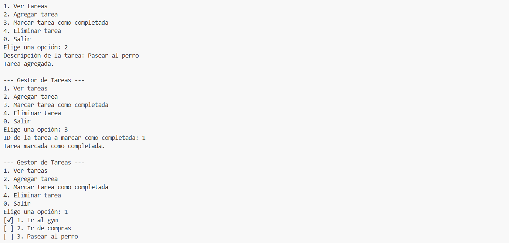

📋 Gestor de Tareas en Consola (Java + SQLite)

Este es un sencillo gestor de tareas ejecutado en consola, desarrollado en Java y utilizando SQLite como base de datos. El proyecto fue realizado y ejecutado en GitHub Codespaces.

✨ Funcionalidades

Agregar nuevas tareas

Listar todas las tareas

Marcar tareas como completadas

Eliminar tareas por ID

Guardado persistente con base de datos SQLite

🛠️ Tecnologías utilizadas

Java 21

SQLite

JDBC (sqlite-jdbc)

GitHub Codespaces

💻 Estructura del Proyecto

TaskManager/
├── lib/
│   └── sqlite-jdbc.jar          # Driver SQLite JDBC
├── database/
│   └── tasks.db                 # Base de datos SQLite
├── src/
│   ├── Task.java                # Modelo de tarea
│   ├── TaskDAO.java             # Acceso a datos
│   └── Main.java                # Interfaz de consola

Ὠ0 Cómo ejecutar

Clonar el repositorio:

git clone https://github.com/FranciscoJALG/TaskManager.git
cd TaskManager

Compilar:

javac -cp ".:lib/sqlite-jdbc.jar" src/*.java -d bin

Ejecutar:

java -cp ".:lib/sqlite-jdbc.jar:bin" Main

✅ Asegúrate de tener el archivo sqlite-jdbc.jar dentro de la carpeta lib/.

🧠 Aprendizajes

Manejo de SQLite desde Java usando JDBC

Organización de un proyecto Java modular

Persistencia de datos

Desarrollo y pruebas en GitHub Codespaces

📸 Capturas

📁 Licencia

Este proyecto está bajo la licencia MIT.

🙇‍♂️ Autor

FranciscoJALG